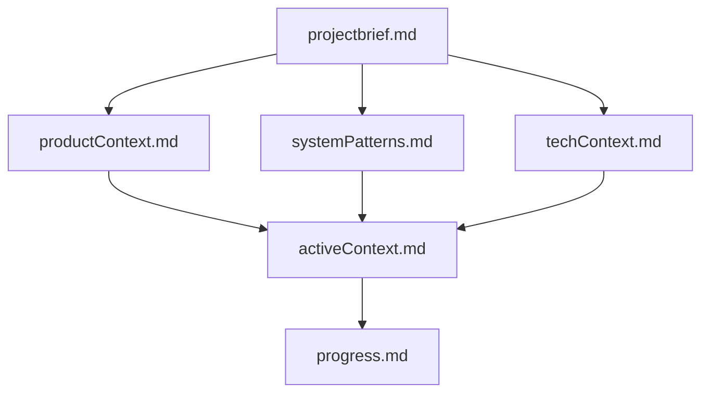

# Memory Bank System

> Persistent context management for Claude Code sessions

## Overview

The Memory Bank System is a structured documentation methodology that enables Claude Code to maintain project context across sessions. Adapted from [Cline Memory Bank](https://docs.cline.bot/prompting/cline-memory-bank), it provides a conceptual framework for AI-assisted development continuity.

## Features

- **Hierarchical Documentation**: Organized memory files that build upon each other
- **Session Lifecycle**: Strategic understanding, tactical execution, and reflective documentation
- **Persistent Context**: Maintain project knowledge across independent sessions  
- **Custom Commands**: Workflow commands for systematic development
- **Flexible Implementation**: Adapts to any development methodology
- **Living Documentation**: Creates valuable project documentation as a natural byproduct

## Usage

### Setup

Follow these steps to install the Memory Bank System in your project:

#### 1. Create Required Directory Structure

Ensure your project has the following `.claude/` subdirectories:
- `.claude/` (main configuration directory)
- `.claude/commands/` (for custom slash commands)
- `.claude/agents/` (for specialized subagents)

Create these directories if they don't exist.

#### 2. Copy Memory Bank Core Files

1. **Copy the conceptual layer:**
   - Copy `memory-bank-system/claude-memory-bank.md` to `.claude/claude-memory-bank.md`

2. **Copy the slash commands:**
   - Copy `memory-bank-system/commands/init-memory-bank.md` to `.claude/commands/init-memory-bank.md`
   - Copy `memory-bank-system/commands/update-memory.md` to `.claude/commands/update-memory.md`
   - Copy `memory-bank-system/commands/maintain-memory.md` to `.claude/commands/maintain-memory.md`

3. **Copy the subagents:**
   - Copy `memory-bank-system/agents/memory-bank-updater.md` to `.claude/agents/memory-bank-updater.md`
   - Copy `memory-bank-system/agents/memory-bank-maintenance.md` to `.claude/agents/memory-bank-maintenance.md`

#### 3. Configure CLAUDE.md

Add the following import to your project's `CLAUDE.md` file:

```markdown
# Your existing CLAUDE.md content...

## Memory Bank System
@.claude/claude-memory-bank.md
```

This import loads the Memory Bank conceptual layer into Claude Code's context.

#### Alternative: User-Level Installation

To install the Memory Bank System for all your projects:
- Use `~/.claude/` instead of `.claude/` for all file paths
- Copy files to your home directory's Claude configuration
- The import in CLAUDE.md remains the same

After setup, the `/init-memory-bank`, `/update-memory`, and `/maintain-memory` commands will be available in your Claude Code session.

### Basic Workflow

1. **Initialize Memory Bank**
   ```
   /init-memory-bank
   ```
   Creates the memory-bank/ directory with core documentation files.

2. **Update Memory Bank**
   ```
   /update-memory              # Full update of all relevant files
   /update-memory progress     # Focus on specific areas
   ```
   Claude Code automatically summarizes your session work and delegates the update to a specialized agent, preserving main context window.

3. **Maintain Memory Bank** (when needed)
   ```
   /maintain-memory            # Archive old content and cleanup
   ```
   Run when the updater recommends maintenance or files become too large.

### Memory Bank Files

Files are created in the `memory-bank/` directory:

- `projectbrief.md` - Foundation document defining core requirements
- `productContext.md` - Why the project exists and how it should work
- `activeContext.md` - Current work focus and recent changes (auto-archived when exceeding 200 lines)
- `systemPatterns.md` - Architecture and design patterns (receives promoted patterns)
- `techContext.md` - Technologies and development setup
- `progress.md` - What works and what's left to build (auto-archived monthly or at 300 lines)

## File Structure

```
memory-bank-system/
├── README.md                    # This file
├── claude-memory-bank.md        # Core system documentation
├── agents/                      # Specialized subagents
│   ├── memory-bank-updater.md   # Content update specialist
│   └── memory-bank-maintenance.md # Archiving and cleanup specialist
└── commands/                    # Custom slash commands
    ├── init-memory-bank.md      # Initialize Memory Bank
    ├── update-memory.md         # Update Memory Bank content
    └── maintain-memory.md       # Perform maintenance tasks
```

## How It Works

### Session Lifecycle

The Memory Bank operates through three core phases:

1. **Context Loading** (Strategic Understanding)
   - Reads Memory Bank files at session start
   - Understands project landscape

2. **Development Work** (Tactical Execution)
   - References relevant Memory Bank sections
   - Implements tasks using context

3. **Context Preservation** (Reflective Documentation)
   - Documents changes and learnings
   - Updates Memory Bank for future sessions

### Memory Hierarchy

Files build upon each other in a clear structure:



### Documentation Updates

Memory Bank updates occur when:
- Discovering new project patterns or architectural decisions
- After implementing significant code changes
- When comprehensive review is needed
- At natural project milestones

### Automatic Archiving

The Memory Bank System includes intelligent archiving to prevent file bloat:

#### Context Lifecycle Management (activeContext.md)
- **Triggers**: 200+ lines, entries older than 30 days, or 50+ Recent Changes
- **Pattern Promotion**: Patterns mentioned 3+ times automatically move to systemPatterns.md
- **Archive Location**: `memory-bank/context-archive/YYYY-MM.md`
- **Benefit**: Keeps activeContext.md focused on current work

#### Changelog Management (progress.md)
- **Triggers**: Monthly or when exceeding 300 lines
- **Archive Location**: `memory-bank/changelog/YYYY-MM-monthname.md`
- **Benefit**: Maintains clean progress tracking

## Custom Commands

The Memory Bank System provides three essential commands:

- `/init-memory-bank` - Creates Memory Bank structure for new projects
- `/update-memory` - Updates Memory Bank documentation with current state
- `/maintain-memory` - Performs archiving and cleanup when needed

Commands can be customized by editing files in `commands/` directory.

## Two-Agent Architecture

### Separation of Concerns

The Memory Bank System uses two specialized agents with distinct responsibilities:

#### memory-bank-updater
- **Focus**: Content updates based on session work
- **Frequency**: After significant changes or milestones
- **Context**: Requires session summary from Claude Code
- **Output**: Updated Memory Bank files + maintenance recommendations

#### memory-bank-maintenance
- **Focus**: Archiving, cleanup, and pattern promotion
- **Frequency**: When thresholds are exceeded or monthly
- **Context**: Self-contained, reads files directly
- **Output**: Cleaned files + archive management

### Update Workflow

1. **Command Trigger**: User executes `/update-memory`
2. **Context Analysis**: Claude Code analyzes the session and prepares a context summary
3. **Content Update**: memory-bank-updater updates files and checks thresholds
4. **Maintenance Check**: If needed, recommends running `/maintain-memory`
5. **Optional Cleanup**: User runs `/maintain-memory` to archive and clean

This architecture preserves the main conversation context while enabling both thorough updates and efficient maintenance.

## Core Principles

The Memory Bank serves as a persistent context layer:

- **Context Continuity**: Seamless continuation across sessions
- **Knowledge Preservation**: Captures project evolution over time
- **Flexible Implementation**: Adapts to any team workflow
- **Living Documentation**: Natural documentation as byproduct

## References

- [Claude Code Memory Management](https://docs.anthropic.com/en/docs/claude-code/memory)
- [Original Cline Memory Bank](https://docs.cline.bot/prompting/cline-memory-bank)