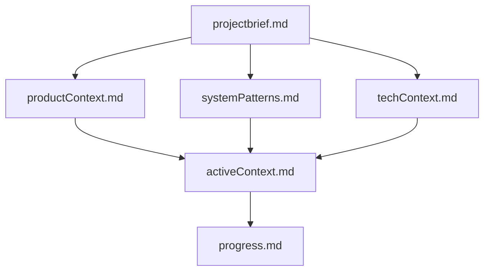
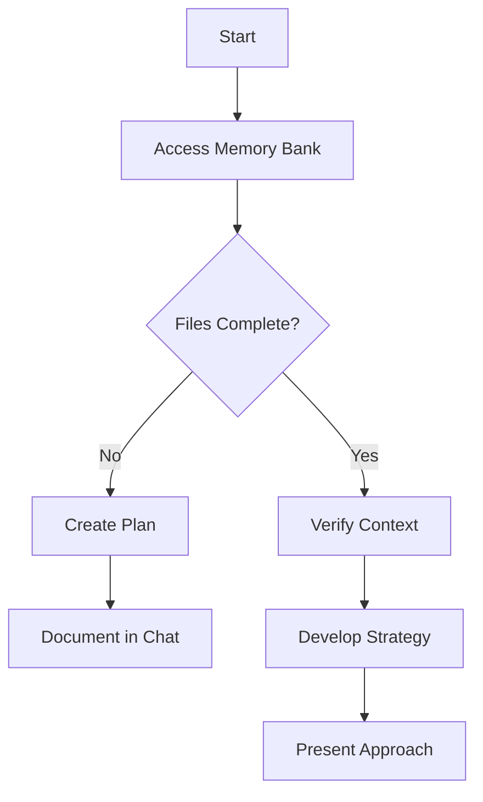
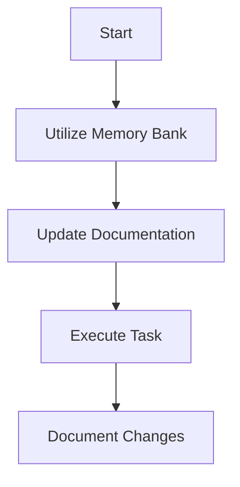
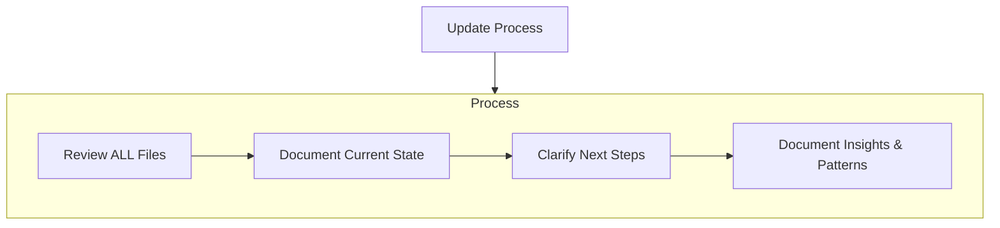
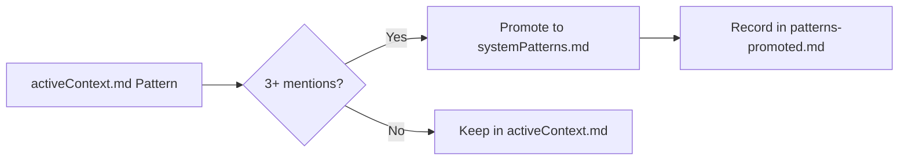

# Claude Code Memory Bank

## Core Operating Instructions

Claude Code operates with session-based memory that resets between conversations. To maintain project continuity and deliver consistent, high-quality assistance, Claude Code must systematically utilize the Memory Bank documentation system at the start of every task.

### Required Actions at Task Start
1. Access Memory Bank context (via @import in CLAUDE.md or by reading files directly)
2. Use the documented context to understand project state and requirements
3. Continue work based on the established patterns and decisions in the documentation

### Why Memory Bank Matters
The Memory Bank ensures:
- Project knowledge persists across sessions, enabling continuous development progress
- Technical decisions remain consistent throughout the project lifecycle
- Team members receive predictable, context-aware assistance
- Documentation naturally evolves alongside the project implementation

## Memory Bank Structure

The Memory Bank consists of core files and optional context files, all in Markdown format. Files build upon each other in a clear hierarchy:



### Core Files (Required)
1. `projectbrief.md`
   - Foundation document that shapes all other files
   - Created at project start if it doesn't exist
   - Defines core requirements and goals
   - Source of truth for project scope

2. `productContext.md`
   - Why this project exists
   - Problems it solves
   - How it should work
   - User experience goals

3. `activeContext.md`
   - Current work focus
   - Recent changes
   - Next steps
   - Active decisions and considerations
   - Important patterns and preferences
   - Learnings and project insights

4. `systemPatterns.md`
   - System architecture
   - Key technical decisions
   - Design patterns in use
   - Component relationships
   - Critical implementation paths

5. `techContext.md`
   - Technologies used
   - Development setup
   - Technical constraints
   - Dependencies
   - Tool usage patterns

6. `progress.md`
   - What works
   - What's left to build
   - Current status
   - Known issues
   - Evolution of project decisions

### Additional Context
Create additional files/folders within memory-bank/ when they help organize:
- Complex feature documentation
- Integration specifications
- API documentation
- Testing strategies
- Deployment procedures

## Core Workflows

Claude Code operates in two distinct states:
- **Plan Mode**: Explicitly activated feature for strategic planning and design thinking. Enter this mode when instructed to plan implementation steps.
- **Act Mode (Default State)**: The standard operating state where Claude Code executes tasks, writes code, and implements solutions. This is the default state when Plan Mode is not active.

### Plan Mode
When explicitly in Plan Mode, Claude Code focuses on strategy and planning:


### Act Mode (Default State)
In the default operating state, Claude Code actively implements and executes:


## Documentation Updates

Memory Bank updates occur when:
1. Discovering new project patterns
2. After implementing significant changes
3. When user requests with **update memory bank** (MUST review ALL files)
4. When context needs clarification



Note: When triggered by **update memory bank**, Claude Code must review every memory bank file, even if some files don't require updates. Focus particularly on activeContext.md and progress.md as they track current state.

## Automatic Maintenance

The Memory Bank System includes intelligent maintenance to prevent file bloat and maintain information freshness:

### Context Lifecycle Management

**activeContext.md Maintenance:**
- Automatically archives Recent Changes older than 30 days to `context-archive/`
- Promotes patterns mentioned 3+ times to systemPatterns.md
- Maintains file size under 200 lines for optimal readability
- Preserves critical current context while archiving historical details

**Pattern Promotion Flow:**


**progress.md Maintenance:**
- Archives completed items monthly to `changelog/YYYY-MM-monthname.md`
- Keeps file under 300 lines for quick scanning
- Preserves decision history and evolution

### Archive Structure

```
memory-bank/
├── context-archive/      # activeContext.md archives
│   ├── index.md         # Navigation and summary
│   ├── YYYY-MM.md       # Monthly archives
│   └── patterns-promoted.md  # Promotion history
└── changelog/           # progress.md archives
    ├── index.md         # Archive summary
    └── YYYY-MM-*.md     # Monthly changelogs
```

---

**Critical Reminder**: Claude Code begins each session without prior context. The Memory Bank serves as the essential bridge between sessions, accessible either through @import directives in CLAUDE.md (when pre-loaded) or by reading files directly (when not imported). This system requires meticulous maintenance and clear documentation to ensure consistent project development and effective assistance.
